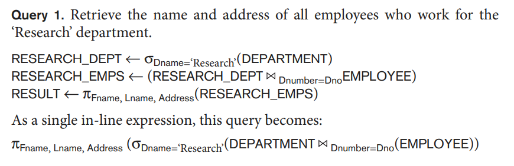
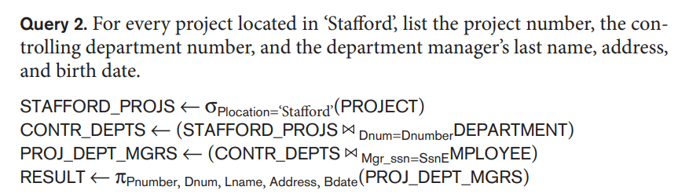
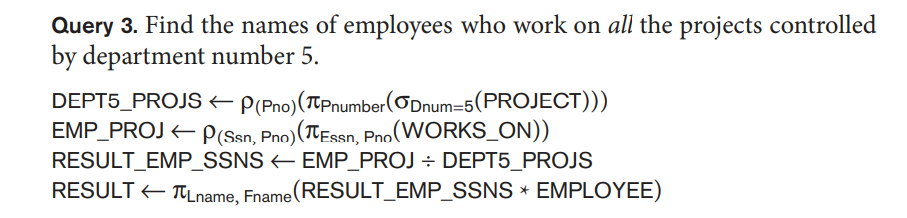
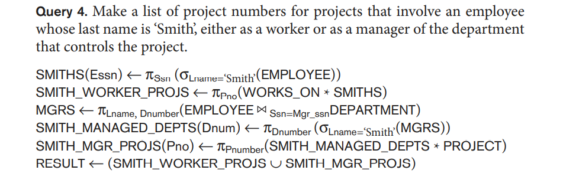
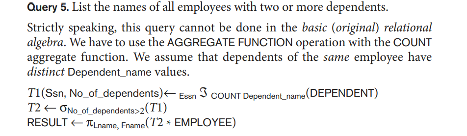

# DBMS Assignment: October 6, 2022

### Questions

1. Retrieve the name and address of all employees who work for the research department.



```sql
select e.fname,e.address from employee e, department d where 
d.dname="Research" and d.dnumber = e.dno;
```

2. For every project located in Stafford list the project number the controlling Department number, and the Department managers last name, address and birth date.



```sql
select p.pnumber,p.dnum,e.lname,e.address,e.bdate 
from project p, department d, employee e
where p.plocation="Stafford" and p.dnum= d.dnumber and d.mgrssn=e.ssn;

```

3. Find the name of employees who work on all the projects controlled by Department number 5.



```sql
SELECT fname, lname FROM employee
WHERE NOT EXISTS
(SELECT pnumber FROM project WHERE dnum=5
AND pnumber NOT IN
(SELECT pno FROM works_on WHERE ssn=essn));
```

4. Make a list of project numbers for projects that involve an employee whose last name is Smith either as a worker or as a manager of the department that controls the project.


```sql
select distinct pnumber
from project,department,employee
where dnum=dnumber and mgrssn=ssn and lname="Smith")
union
(select distinct pnumber
from project,works_on,employee
where pnumber=pno and essn=ssn and lname="Smith");
```

5. List the names of all employees with two or more dependents . Strictly speaking, this query cannot be done in the basic (original) relational algebra.  We have to use `AGGREGATE FUNCTION` operation with the `COUNT` aggregate function. We assume that department of the same employee have distinct DEPENDENT NAME values.



```sql

```
